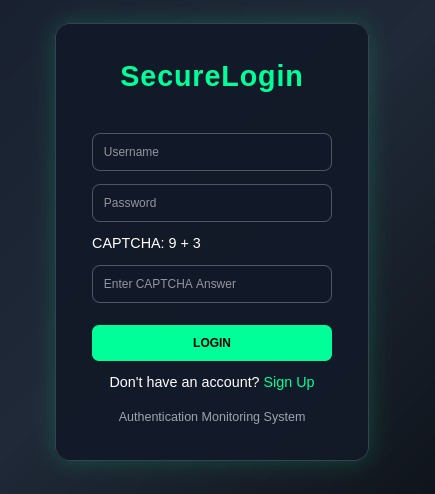
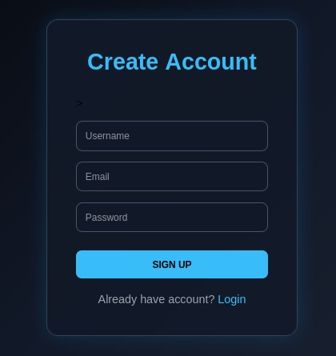
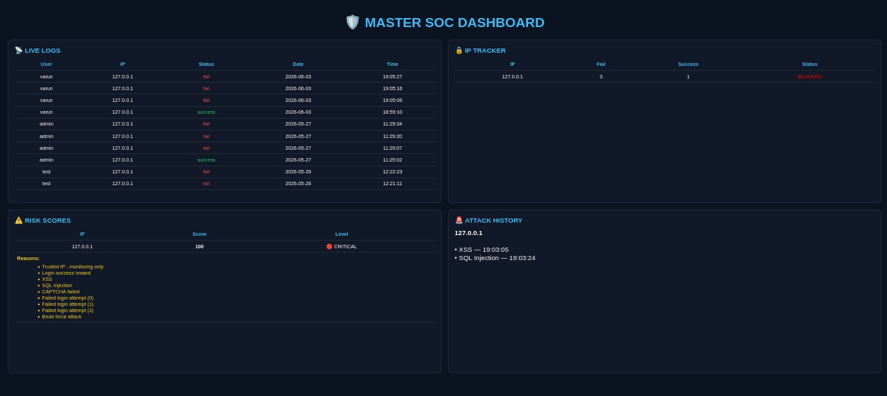
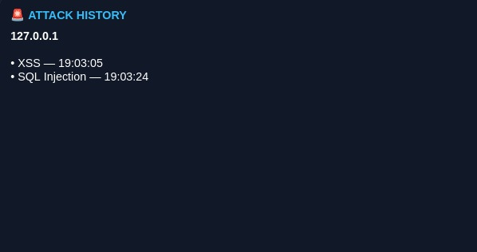
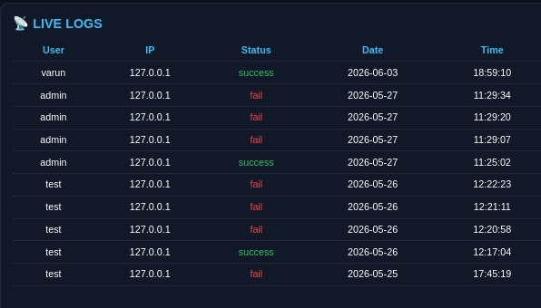
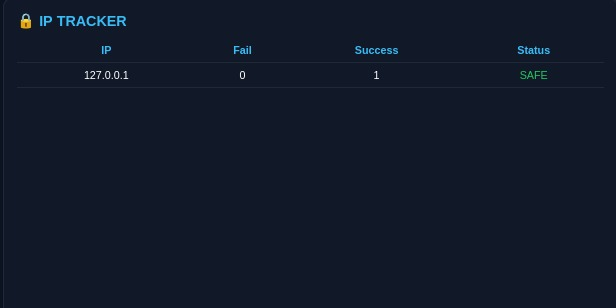
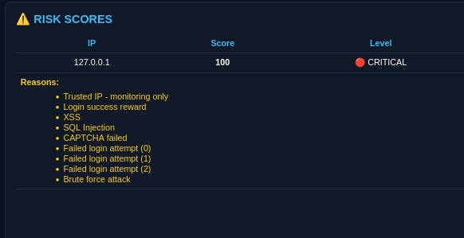

# 🔐 SecureLogin System with Attack Detection

## 🚀 Project Overview
This is a Flask-based secure login system with built-in cyber attack detection, risk scoring, CAPTCHA verification, and real-time monitoring features.

It detects and protects against:
- SQL Injection
- XSS attacks
- Command Injection
- Brute force attacks
- High request rate abuse

---

## ⚙️ Features

### 🔐 Authentication Security
- Secure login/signup system
- Password hashing using bcrypt
- Session-based authentication
- Session timeout system

### 🛡️ Attack Detection
- SQL Injection detection
- XSS detection
- Command Injection detection
- Path traversal detection

### 📊 Security Engine
- Risk scoring system per IP
- Risk levels: LOW / MEDIUM / HIGH / CRITICAL
- Attack history tracking

### 🚨 Protection System
- Brute force detection
- Auto account locking
- IP blocking system
- CAPTCHA verification

### 📡 Monitoring
- Login logs tracking
- IP behavior monitoring
- Admin dashboard

---

## 🛠 Tech Stack
- Python
- Flask
- Flask-SQLAlchemy
- SQLite
- bcrypt
- HTML/CSS

---

## 📸 Screenshots
## 📸 Screenshots

### 🔐 Login Page

### 📝 Signup Page

### 📊 Dashboard

### 🧠 Attack History

### 📡 Live Logs

### 🚨 IP Tracker

### 🔥 Risk Score Monitoring

### 🚫 IP Blocked Screen

---

## 🔗 Author
Built by Varun (Cyber Security Learner at FITA Academy)
